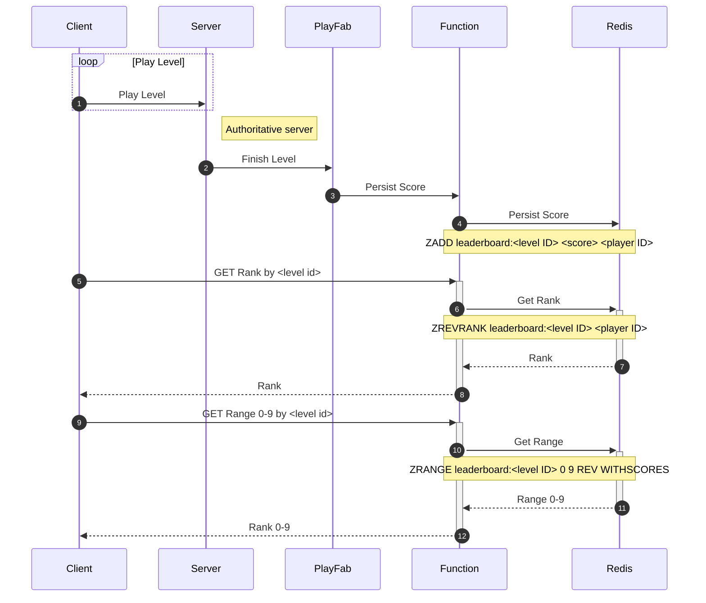

# PlayFabLevelLeaderbaords
This project is a demo/example/template to build Level Based Leaderboards with [Azure PlayFab](https://playfab.com).

⚠️ **This project is provided as-is, without any warranty.** ⚠️

Imagine, you have a map editor for your game, where every player can build their own maps, and other players can play those maps.

For each of these maps, there should be an individual leaderboard, which tracks player's scores.
While PlayFab has a good functionality around leaderboards, these have their limits and does not scale well. Particularly because there is an upper limit of 300!

Instead, we will be using [Azure Functions](https://learn.microsoft.com/en-us/azure/azure-functions/functions-overview) and [Redis on Azure](https://learn.microsoft.com/en-us/azure/azure-cache-for-redis/) to implement level based leaderboards.
This scales very well, both in terms of performance and cost.

* The Azure Function will be called whenever the player finishes a level, and will update the leaderboard.
* The Azure Function will also be called whenever the player requests the leaderboard, and will return the leaderboard data.
* The Redis cache will be used to store the leaderboard data.
* The Redis cache will be updated by the Azure Function, and will be read by the Azure Function.

# Architecture

# Prerequisites
* [Azure Subscription](https://azure.microsoft.com/en-us/solutions/gaming/) ( or [sign up for ID@Azure](https://azure.com/id) )
* [Azure Service Principal](https://docs.microsoft.com/en-us/azure/active-directory/develop/howto-create-service-principal-portal)
* [Terraform](https://terraform.io)
* [Azure PlayFab Account](https://playfab.com/)
* [.NET 6](https://dot.net)

# Development Prerequisites
* An [Azure Subscription](https://azure.microsoft.com/en-us/solutions/gaming/)
* [.NET 6 SDK](https://dot.net)
* CosmosDB, either on Azure, or using the [CosmosDB Emulator](https://docs.microsoft.com/en-us/azure/cosmos-db/local-emulator?tabs=ssl-netstd21)
* Azure BlobStorage, or use [Azurite](https://github.com/Azure/Azurite) as a local storage emulator.

# Deploying
## PlayFab
* Get your Title ID (from the Game Studio dashboard or from the GameManager)
* Get a developer secret key:
  
* Copy it to later use it in an environment variable or as parameter to Terraform

## Terraform
You can either choose to set the PlayFab *Title Id* and *Developer Secret* as environment variables (recommended, see below), or you can choose not to do so, and instead provide the secret when calling `terraform plan` or `terraform apply`, respectively.

### Environment Variables
> These are optional, but if you do not set them, you will be prompted by Terraform for their values.

| Name     | Description    |
|----------|----------|
| `TF_VAR_pf_title_id` | A PlayFab Title ID to authenticate against |
| `TF_VAR_pf_developer_secret` | A PlayFab Developer Secret for the above Title |

### Init Terraform:

Before initializing, set up a copy of `example.backend.config.tf`, and configure an existing storage account and container to be used for Terraform state management.

Then, init:

    terraform init -backend-config='.\config\backend.local.config.tf'

### Apply

    terraform apply

